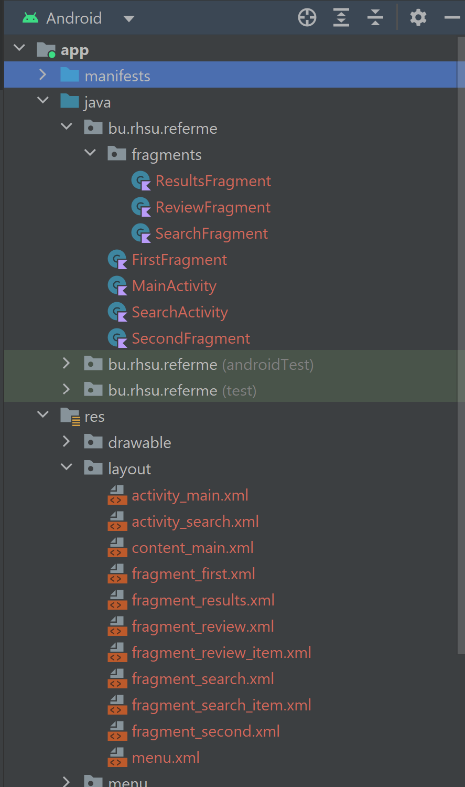

# METCS683Assignments

**This README is used for note taking throughout the class project. The Project Report can be found in**
[Project Report](./CS683_RyanHsu_ReferME.md)

Ryan Hsu

## Instructions
- This is the template of your project report.  As this document will be constantly updated during the semester, please enable the “track changes” in your doc. Or if you prefer to use the md file, we can also see the changes in the commits or use diff.
- Please name your report as CS683_\<your name\>_\<ProjectTitle\>. It can be either a PDF or Word document.
- Make sure to push all your code into your github repository, create a release/tag and submit the link on blackboard.
- Please provide your feedback in the “Add comments” section when submitting your report. Thanks!

## Overview
Online reviews are everywhere for restaurants, products, and services and healthcare is not far behind those. To that end, 
online reviews for healthcare is growing rapidly but is also hard to find and hard to give reviews. It is also a field where
personal referrals still hold a lot of weight. 

The purpose of this app, ReferMe *(working title), is to provide a platform to grade, review and refer 
healthcare as a service to the public, by the public and for the public. And as it is only to review healthcare services
it will be more specific in it's UX to healthcare specific attributes. 

The users of this app would be anyone that is needs to find any health service. For example, which PCP should I go to if I just
moved to an area. What specialist is most liked for this issue? What office is easiest to be a patient at? Which clinic has
the best laboratory facility? 

## Related Work
Similar apps in the app store:

Yelp
Similarities
- Allows for the businesses to post their service
- Allows for any user to review a service (mostly restaurants) 
- Allows users to write a review 
- Allows users to give a score and averages this score allowing the platform to sort restaurants by these scores
- Points out helpful attributes of the service (e.g. good for kids, takeout and delivery available etc.)

Differences
- Yelp relegates the score to a 1 to 5 star system. 
  - ReferMe will combine the grade of 3 major items to provide a more balanced score
    3 Categories being: Bedside manner, Expertise, Front office *(subject to change) 

Google Maps (Reviews for businesses)
- Allows for the businesses to post their service
- Allows for any user to review a service (mostly restaurants)
- Allows users to write a review
- Allows users to give a score and averages this score allowing the platform to sort restaurants by these scores

Differences
- Needs a searchable businesses to give a review
  - ReferMe will allow users to search by provider 

## Requirement Analysis and Testing
| Title (Essential/Desirable/Optional) | Search database for a provider (Essential)                                                                                                                               |
|-----------------------------------------|--------------------------------------------------------------------------------------------------------------------------------------------------------------------------|
| Description                             | As a user, I want to be able to search for a provider that I want to review or see reviews of                                                                            |
| Mockups                                 |                                                                                                                                         |
| Acceptance Tests                        | Given a search bar is shown on the screen, When the user enters a name, results of existing providers are returned. If new, the option to create a new posting is given. |
| Test Results                            |                                                                                                                                                                          |
| Status                                  | UI is still under works. Not yet implemented yet.                                                                                                                        |

|Title (Essential/Desirable/Optional) | Give a review (Essential)                                                                                                                                |
|---|----------------------------------------------------------------------------------------------------------------------------------------------------------|
|Description| As a user, I want to be able to review a provider                                                                                                        |
|Mockups|                                                                                                                         |
|Acceptance Tests| When the user finds a posting of a provider, they are given the option to review the provider. This review process can be found in the following feature |
|Test Results|                                                                                                                                                          |
|Status|                                                                                                                                                          |

|Title (Essential/Desirable/Optional) | Review system (Essential)                                                                                                   |
|---|-----------------------------------------------------------------------------------------------------------------------------|
|Description| As a user, I want to be able to review a provider quickly and/or write a review                                             |
|Mockups|                                                                                      |
|Acceptance Tests| When the user chooses to review a provider, the new review system is presented with the option of writing a review as well. |
|Test Results|                                                                                                                             |
|Status|                                                                                                                             |

|Title (Essential/Desirable/Optional) | Search by specialty (Desirable)                                                                                                              |
|---|----------------------------------------------------------------------------------------------------------------------------------------------|
|Description| As a user, I want to be able to search by specialty for providers to review or read reviews of                                               |
|Mockups|                                                                                                             |
|Acceptance Tests| Given a search bar is shown on the screen, When the user enters a specialty, results of existing providers with that specialty are returned. |
|Test Results|                                                                                                                                              |
|Status|                                                                                                                                              |

|Title (Essential/Desirable/Optional) | Register as a user (Essential)                                                                                                        |
|---|---------------------------------------------------------------------------------------------------------------------------------------|
|Description| As a user, I want to be able to review under a username that may not include my personal information but just pertinent information   |
|Mockups|                                                                                                      |
|Acceptance Tests| When the user wants to give a review, they must register with ReferME and provide some pertinent information, but nothing identifying |
|Test Results|                                                                                                                                       |
|Status|

|Title (Essential/Desirable/Optional) | Database of Providers (Essential)                                          |
|---|----------------------------------------------------------------------------|
|Description| As a user, I want to have a database of providers in the system to review  |
|Mockups|                                 |
|Acceptance Tests| When the user reviews a provider, it will be saved in the ReferME database |
|Test Results|                                                                            |
|Status|

|Title (Essential/Desirable/Optional) | Utilize Google Business API for search (Optional)                                                                             |
|---|-------------------------------------------------------------------------------------------------------------------------------|
|Description| As a user, I want to be able to search the businesses Google is already aware of to save me from having to enter my own data. |
|Mockups|                                                                                                                               |
|Acceptance Tests| Given a search bar is shown on the screen, When the user enters a search term, Google's API will return results.              |
|Test Results|                                                                                                                               |
|Status|

## Design and Implementation

* Iteration 0
ReferMe is mainly focused on being a new review system. However, for this it has to utilize a simple search UI for users to search for providers given a location. 
After searching for providers, users can review them with a simple review system. The search functionality is not as big a focus as there are different APIs that could
help this functionality. However, ReferMe will allow the user to search by a provider and not just a registered business.

The review system will ask the user to rate from 1 to 10 regarding four major areas: Bedside manner, Expertise, Front Office staff, and Facility. This allows users to quickly
review a provider or clinic without having to write down each of these important things. This gives more of a concise review and quantifies each area for users to more easily
differentiate depending on what is more important to them. These 10 points will be displayed as 5 stars.
So each point is worth half a star. 

Eventually, the app may be able to use Google's Business API to help search functionality. 

* Iteration 1
Create UIs for search, results and review fragments with their corresponding layout XMLs.

The following files created:
* SearchFragment.kt 
* ReviewFragment.kt 
* ResultsFragment.kt 
* SearchActivity.kt 
* fragment_review.xml 
* fragment_search.xml 
* fragment_results.xml 
* fragment_review.xml 
* fragment_review_item.xml 
* fragment_search.xml 
* fragment_search_item.xml 
* searchable.xml
* bottom_nav_menu.xml
* Provider.kt

**ReviewFragment.kt and fragment_review.xml**
The UI for when a single provider has been clicked to view includes the provider picture, if it exists,
their name, specialty and contact info. Then, using a linear layout, four categories will be displayed
below using a ratings bar for each category: Bedside Manner, Expertise, Front Office and Facility.

I am still considering what to do for the bottom portion and am going between either having a rolling
RecyclerView of written reviews or maybe a RecyclerView of keywords from written reviews.

Fragment Displaying a Single Searched Provider

**fragment_first.xml**
The UI for when the user reviews a provider has the same avatar plus provider information as the review
fragment. I think this could be centralized since they are the same in a later iteration. The review
section uses Material UI discrete sliders and has some textual descriptions of bad - good to help
the user. 

Also, I will update the name of the xml to be something more descriptive.

Fragment Displaying Screen to Review a Provider

**SearchFragment.kt, fragment_search.xml, SearchActivity.kt, searchable.xml**
I started work on the search functionality. The hope is to use the SearchBar from the Materials UI 
components. For this I started created a searchable activity and a menu layout to later place in the 
tool bar in activity_main.xml. For now a layout with just a RecyclerView is the place holder. 

Fragment Displaying Search Results

_This fragment may be recycled to for a different use after Search functionality is completed
as it may be done in the toolbar instead_

**Navigation, bottom_nav_menu.xml**
A bottom navigation has been added to the main activity and will be the main way users can move between
UIs. Currently, there are three buttons: home, search and results. For now, search will be the search
UI with a searchbar, results will be the UI that holds the results and as for now home has nothing
on it but may just have a single search text box that on click moves the user to the search bar on the
search fragment when data is entered.

A fourth button will be added in iteration 4 that adds user registration.

A searchable activity was also created in advance for search functionality to be done
in the Iteration 4

Intent Added to Manifest File

Searchable XML Resource Created

The next step is finishing the logic behind these UIs, for now a companion object may be used just
to test these UIs with a temporary Provider instance. Eventually, this will be replaced with a database.

There is also one last piece to the UI that needs to be designed which is the "written review" section.
The thought behind this app is to remove the need to read reviews, so this may be simple logic that
reads the reviews, grabs the keywords used the most often and display the keywords in a gridlayout.

## Project Structure
Current Project Structure

## Timeline
Iteration 0 - Planning and proposal phase
- Provide mockups of essential requirements for a minimum viable product
- Give the overview of the systems purpose
- Decide on the minimum sdk Android 9 (there are features from API 28 that want to be used)

Iteration 1 - UI Design and 

| Iteration | Application Requirements (Eseential/Desirable/Optional)             | Android Components and Features        | 
|-----------|---------------------------------------------------------------------|----------------------------------------|
| 0         | Mockups for all essential requirements and documentation            | None                                   |
| 1         | Create UIs for Results (Essential) and Review (Essential)           | Layouts and Navigation                 |
| 2         | Register as a User (Essential), Database of Providers (Essential)   | Activities, Services, Content Provider |
| 3         | Search database for provider (Essential), Give a Review (Essential) | Activities, Content Provider           |

## Future Work (Optional)

## Project Demo Links

## References
https://play.google.com/store/apps/details?id=com.yelp.android&hl=en_US&gl=US
 
https://play.google.com/store/apps/details?id=com.google.android.apps.maps&hl=en_US&gl=US
